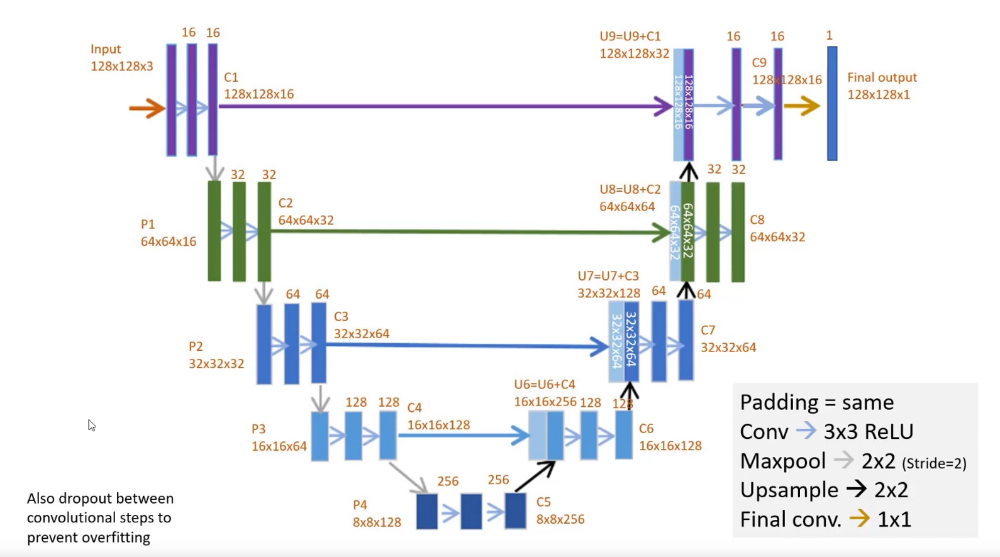

# Nuclei_semantic_segmentation
# Original paper for U-Net: 
- U-Net: https://arxiv.org/abs/1505.04597

### U-Net Architecture

### Dataset:
- Dataset Link: https://www.kaggle.com/competitions/data-science

## Project Setup:

**1. Create conda environment**
```bash
conda create -n venv python==3.8 -y
```
**2. Clone Github repository**
```bash
https://github.com/MannShrestha/Nuclei_semantic_segmentation.git
```
**3. Install requirements**
```bash
pip install -r requirements.txt
```

## Input sanity input check


## Model Architecture
```bash
pip install visualkeras
```


## Model Acccuracy and Loss


## Train Prediciton


## Validation Prediciton


